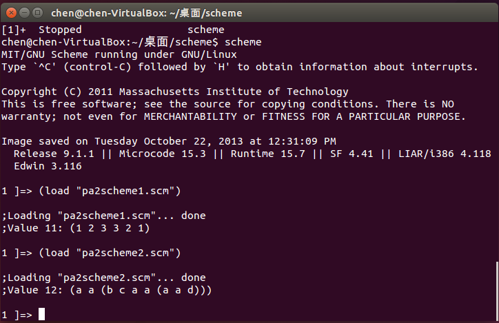

程式語言 Scheme 作業
===================

[題目在此](PA2.txt)

###範例輸出



```scheme
(palindrome '(1 2 3))
; (1 2 3 3 2 1)

(dbl_atm 'a '(a (b c a (a d))))
; (a a (b c a a (a a d)))
```


###說明
####安裝與使用(Ubuntu)

```bash
sudo apt-get install mit-scheme
scheme  # 啟動 scheme

```

####Debug 用的 print function

```scheme
(define (print . args)
  (cond ((not (null? args))
         (display (car args))
         (apply print (cdr args)))))
```

